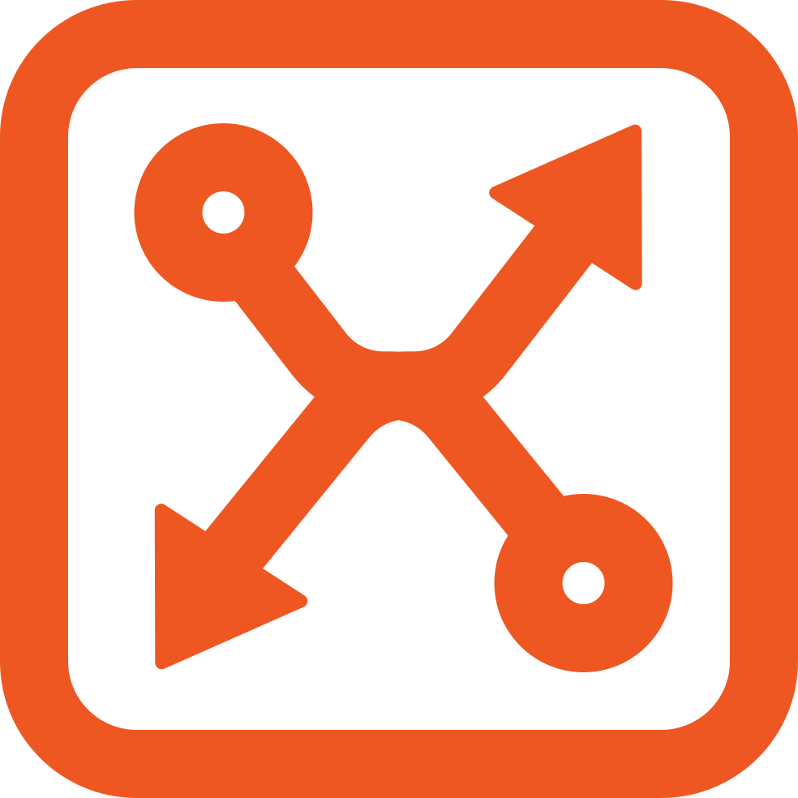

  

<h1 class="label">
  XMESS
</h1>

> connecting module

- 🔗 Event based module communication
- ⚡️️ Rich configuration set up
- 🚀 Rich API
- 💎 Best practices support

  <a href="https://github.com/ciklum-digital/xmess" target="_blank">GitHub</a>
  <a href="#/README">Get Started</a>

